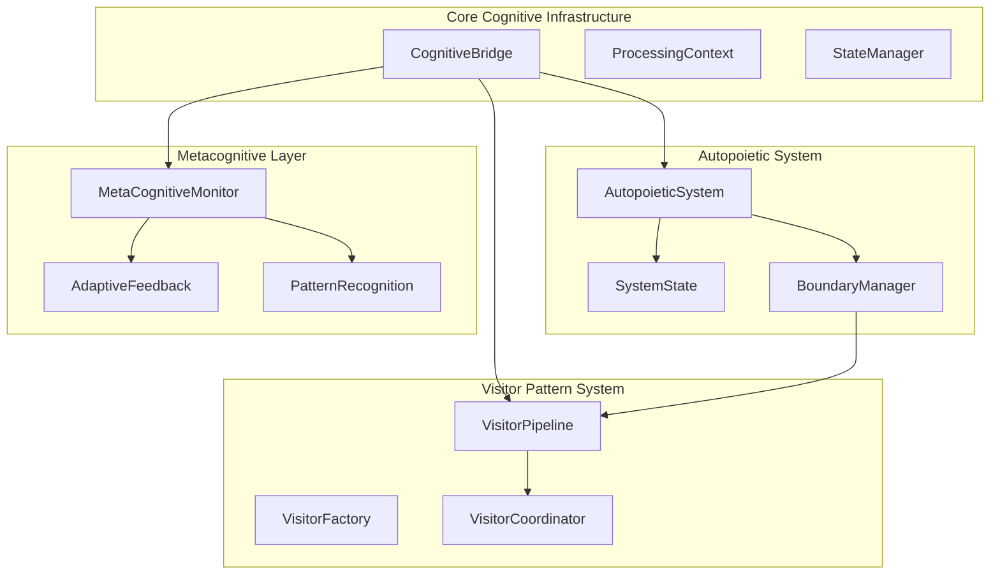
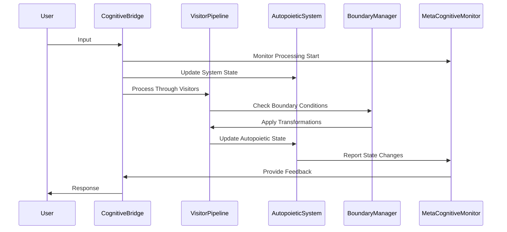

# Design Document

## Overview

The Core Cognitive Structures implementation provides a sophisticated, modular architecture for cognitive processing systems with autopoietic capabilities. The design integrates metacognitive monitoring, visitor pattern extensions, boundary transformation logic, and self-adaptive systems following the theoretical foundations of Maturana & Varela's autopoiesis, Flavell's metacognition, and Clark & Chalmers' extended mind theory.

The architecture supports emergent learning ecosystems through dynamic boundary management, recursive observational potential transformation, and adaptive feedback loops that enable systems to self-maintain and evolve their processing capabilities.

## Architecture

### High-Level Architecture



### Processing Flow



## Components and Interfaces

### 1. Core Cognitive Infrastructure

#### CognitiveBridge
The central orchestrator that manages cognitive processing workflows.

```mojo
struct CognitiveBridge:
    """Main bridge for cognitive processing with metacognitive capabilities."""
    
    var context: ProcessingContext
    var state_manager: StateManager
    var visitor_pipeline: VisitorPipeline
    var autopoietic_system: AutopoieticSystem
    var metacognitive_monitor: MetaCognitiveMonitor
    
    fn __init__(inout self) raises:
        """Initialize with integrated cognitive systems."""
        
    fn process_input(inout self, input: String) raises -> CognitiveResponse:
        """Process input through integrated cognitive pipeline."""
        
    fn adapt_processing_strategy(inout self, feedback: AdaptiveFeedback) raises:
        """Adapt processing based on metacognitive feedback."""
```

#### ProcessingContext
Thread-safe context management for cognitive processing state.

```mojo
struct ProcessingContext:
    """Thread-safe context for cognitive processing."""
    
    var current_state: SystemState
    var processing_history: List[ProcessingEvent]
    var error_log: List[CognitiveError]
    var performance_metrics: PerformanceTracker
    
    fn update_state(inout self, new_state: SystemState) raises:
        """Update processing state with validation."""
        
    fn add_processing_event(inout self, event: ProcessingEvent) raises:
        """Record processing event for metacognitive analysis."""
```

### 2. Enhanced Visitor Pattern System

#### VisitorPipeline
Manages sequential and parallel visitor execution with cognitive extensions.

```mojo
struct VisitorPipeline:
    """Pipeline for managing cognitive visitor execution."""
    
    var visitors: List[CognitiveVisitor]
    var execution_strategy: ExecutionStrategy
    var boundary_manager: BoundaryManager
    
    fn add_visitor(inout self, visitor: CognitiveVisitor) raises:
        """Add visitor with boundary validation."""
        
    fn execute_pipeline(inout self, element: TagElement) raises -> ProcessingResult:
        """Execute visitor pipeline with boundary management."""
        
    fn optimize_execution_order(inout self) raises:
        """Optimize visitor order based on performance metrics."""
```

#### CognitiveVisitor
Extended visitor interface with cognitive-specific capabilities.

```mojo
trait CognitiveVisitor:
    """Enhanced visitor interface for cognitive processing."""
    
    fn visit_tag_element(inout self, element: TagElement, context: ProcessingContext) raises
    fn visit_cognitive_bridge(inout self, bridge: CognitiveBridge, context: ProcessingContext) raises
    fn visit_autopoietic_system(inout self, system: AutopoieticSystem, context: ProcessingContext) raises
    fn get_processing_metrics(self) -> VisitorMetrics
    fn adapt_to_feedback(inout self, feedback: AdaptiveFeedback) raises
```

### 3. Autopoietic System Integration

#### AutopoieticSystem
Self-maintaining system with adaptive capabilities following autopoietic principles.

```mojo
struct AutopoieticSystem:
    """Self-maintaining cognitive system with autopoietic properties."""
    
    var system_state: SystemState
    var boundary_conditions: BoundaryConditions
    var adaptation_rules: AdaptationRuleSet
    var self_maintenance_cycle: MaintenanceCycle
    
    fn maintain_system_integrity(inout self) raises:
        """Maintain autopoietic system integrity."""
        
    fn adapt_to_environment(inout self, environmental_changes: EnvironmentalState) raises:
        """Adapt system based on environmental feedback."""
        
    fn check_system_viability(self) -> ViabilityStatus:
        """Check if system maintains autopoietic viability."""
```

#### SystemState
Immutable state representation with transition management.

```mojo
struct SystemState:
    """Immutable system state with transition capabilities."""
    
    var state_data: PythonObject  # Thread-safe state storage
    var timestamp: Int64
    var complexity_metrics: ComplexityMetrics
    var stability_indicators: StabilityMetrics
    
    fn transition_to(self, new_state: SystemState) -> StateTransition:
        """Create validated state transition."""
        
    fn calculate_stability(self) -> Float64:
        """Calculate system stability metrics."""
```

### 4. Boundary Transformation Logic

#### BoundaryManager
Manages dynamic boundary transformations with recursive potential analysis.

```mojo
struct BoundaryManager:
    """Manages dynamic boundary transformations."""
    
    var current_boundaries: BoundarySet
    var transformation_rules: TransformationRuleSet
    var observational_thresholds: ObservationalThresholds
    var transformation_history: TransformationHistory
    
    fn evaluate_transformation_potential(self, context: ProcessingContext) -> TransformationPotential:
        """Evaluate potential for boundary transformation."""
        
    fn apply_boundary_transformation(inout self, transformation: BoundaryTransformation) raises:
        """Apply validated boundary transformation."""
        
    fn rollback_transformation(inout self, transformation_id: String) raises:
        """Rollback failed transformation to stable state."""
```

#### TransformationEngine
Handles complex boundary transformation logic with conflict resolution.

```mojo
struct TransformationEngine:
    """Engine for processing boundary transformations."""
    
    var conflict_resolver: ConflictResolver
    var validation_system: TransformationValidator
    var rollback_manager: RollbackManager
    
    fn process_transformation(inout self, transformation: BoundaryTransformation) raises -> TransformationResult:
        """Process transformation with validation and conflict resolution."""
        
    fn detect_transformation_conflicts(self, transformations: List[BoundaryTransformation]) -> List[TransformationConflict]:
        """Detect conflicts between multiple transformations."""
```

### 5. Metacognitive Monitoring System

#### MetaCognitiveMonitor
Implements Flavell's metacognitive monitoring with adaptive capabilities.

```mojo
struct MetaCognitiveMonitor:
    """Metacognitive monitoring system with adaptive feedback."""
    
    var monitoring_state: MonitoringState
    var performance_analyzer: PerformanceAnalyzer
    var pattern_detector: PatternDetector
    var adaptation_engine: AdaptationEngine
    
    fn monitor_cognitive_load(inout self, processing_context: ProcessingContext) raises:
        """Monitor cognitive load and performance metrics."""
        
    fn detect_processing_patterns(inout self) raises -> List[CognitivePattern]:
        """Detect emergent processing patterns."""
        
    fn generate_adaptive_feedback(inout self) raises -> AdaptiveFeedback:
        """Generate feedback for system adaptation."""
```

## Data Models

### Core Data Structures

```mojo
struct TagElement:
    """Enhanced tag element with cognitive properties."""
    var id: String
    var name: String
    var content: String
    var children: List[TagElement]
    var metadata: CognitiveMetadata
    var processing_state: ElementProcessingState

struct CognitiveResponse:
    """Response from cognitive processing."""
    var content: String
    var confidence: Float64
    var processing_metrics: ProcessingMetrics
    var adaptive_suggestions: List[AdaptiveSuggestion]

struct BoundaryTransformation:
    """Represents a boundary transformation operation."""
    var transformation_id: String
    var source_boundary: BoundaryState
    var target_boundary: BoundaryState
    var transformation_rules: List[TransformationRule]
    var validation_criteria: ValidationCriteria
```

### State Management Models

```mojo
struct ProcessingEvent:
    """Event in cognitive processing pipeline."""
    var event_id: String
    var timestamp: Int64
    var event_type: ProcessingEventType
    var context_snapshot: ProcessingContext
    var performance_data: PerformanceData

struct AdaptiveFeedback:
    """Feedback for system adaptation."""
    var feedback_type: FeedbackType
    var confidence_level: Float64
    var suggested_adaptations: List[SystemAdaptation]
    var performance_impact: PerformanceImpact
```

## Error Handling

### Error Hierarchy

```mojo
trait CognitiveError:
    """Base trait for cognitive system errors."""
    fn get_error_code(self) -> String
    fn get_error_message(self) -> String
    fn get_recovery_suggestions(self) -> List[RecoverySuggestion]

struct ProcessingError(CognitiveError):
    """Errors during cognitive processing."""
    var processing_stage: ProcessingStage
    var context_state: ProcessingContext
    var error_details: ErrorDetails

struct BoundaryTransformationError(CognitiveError):
    """Errors during boundary transformations."""
    var transformation_context: TransformationContext
    var conflict_details: ConflictDetails
    var rollback_information: RollbackInfo
```

### Error Recovery Strategies

1. **Graceful Degradation**: System continues with reduced functionality
2. **State Rollback**: Return to last known stable state
3. **Alternative Processing**: Switch to backup processing strategies
4. **User Notification**: Inform user of processing limitations

## Testing Strategy

### Unit Testing Approach

1. **Component Isolation**: Test each cognitive component independently
2. **State Validation**: Verify state transitions and integrity
3. **Boundary Condition Testing**: Test edge cases and error conditions
4. **Performance Benchmarking**: Measure processing performance metrics

### Integration Testing Strategy

1. **Pipeline Testing**: Test complete visitor pipeline execution
2. **Autopoietic Integration**: Verify autopoietic system integration
3. **Boundary Transformation Testing**: Test complex transformation scenarios
4. **Metacognitive Feedback Loops**: Test adaptive feedback mechanisms

### Cognitive Behavior Testing

1. **Emergence Testing**: Verify emergent behavior patterns
2. **Adaptation Testing**: Test system adaptation capabilities
3. **Learning Validation**: Verify learning and pattern recognition
4. **Stability Testing**: Ensure system stability under various conditions

### Test Data and Scenarios

```mojo
struct CognitiveTestScenario:
    """Test scenario for cognitive system validation."""
    var scenario_name: String
    var input_data: TestInputData
    var expected_outcomes: ExpectedOutcomes
    var performance_criteria: PerformanceCriteria
    var validation_rules: ValidationRules
```

## Performance Considerations

### Optimization Strategies

1. **Lazy Evaluation**: Defer expensive computations until needed
2. **Caching**: Cache frequently accessed cognitive patterns
3. **Parallel Processing**: Utilize parallel visitor execution where safe
4. **Memory Management**: Efficient state management and cleanup

### Scalability Design

1. **Modular Architecture**: Components can be scaled independently
2. **Resource Monitoring**: Track and optimize resource usage
3. **Load Balancing**: Distribute processing across available resources
4. **Adaptive Throttling**: Adjust processing intensity based on load

### Memory and Resource Management

```mojo
struct ResourceManager:
    """Manages system resources for cognitive processing."""
    var memory_pool: MemoryPool
    var processing_threads: ThreadPool
    var cache_manager: CacheManager
    
    fn optimize_resource_allocation(inout self) raises:
        """Optimize resource allocation based on current load."""
```