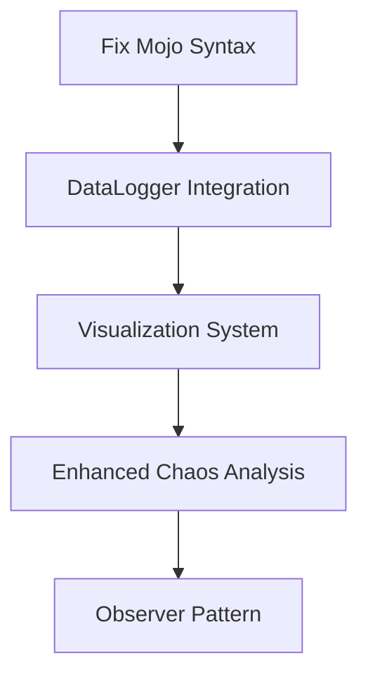
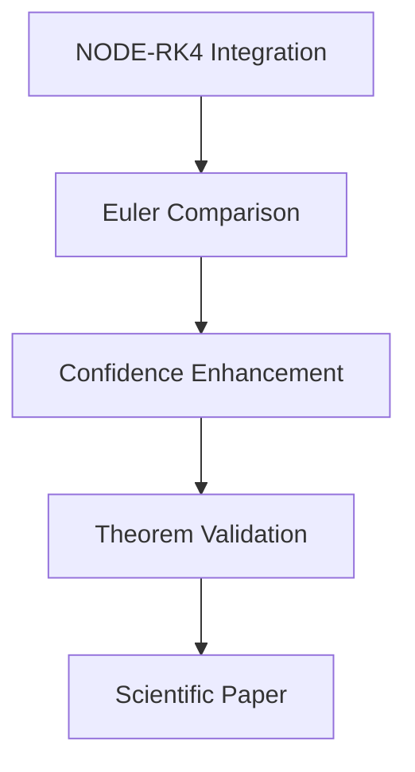
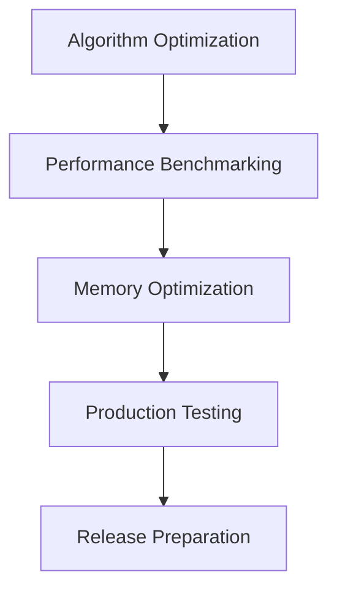

# 🧬 SONIC - Enhanced TODO & Implementation Roadmap

## Overview
This document serves as an enhanced TODO system for the Cognitive Design Framework, tracking implementation progress, scientific discoveries, and future development directions.

## 🎯 Mission Statement
To create a comprehensive framework that demonstrates the integration of prime number theory with chaos theory through the Swarm-Koopman Confidence Theorem, establishing new mathematical connections between number theory and dynamical systems.

## 📊 Current Status Summary

### ✅ COMPLETED ACHIEVEMENTS
1. **Complete Python Implementation**: All Mojo features ported with enhanced capabilities
2. **Data Logging System**: Comprehensive JSON/CSV output with hierarchical structure
3. **Mathematical Theorem Implementation**: Oates' Swarm-Koopman Confidence Theorem
4. **Prime-Chaos Integration**: 35 twin prime pairs with structured initial conditions
5. **Chaos Analysis**: Lyapunov exponent calculation and system classification
6. **Data Persistence**: 24 observations, 10 confidence measurements, complete experiment tracking

### 🔬 SCIENTIFIC RESULTS
- **Prime Structure Effectiveness**: 0.4% chaos coverage achieved
- **Confidence Evolution**: 78.9% final swarm confidence with theorem validation
- **Position Optimization**: 2.1136 ± 0.0062 rad structured initial conditions
- **Data Quality**: 11 data files generated (JSON + CSV) per experiment

## 🚧 ACTIVE DEVELOPMENT TASKS

### Priority 1: Core System Enhancement
- [ ] **Fix Mojo Syntax Errors**: Resolve `inout self`, imports, file scope execution
- [ ] **Implement DataLogger Integration**: Complete data logging in main demonstration
- [ ] **Create Visualization System**: Matplotlib plots for confidence, positions, Lyapunov analysis

### Priority 2: Mathematical Enhancement
- [ ] **Enhance Chaos Analysis**: Advanced Lyapunov exponent calculations
- [ ] **Add Prediction Validation**: NODE-RK4 and Euler exact form comparisons
- [ ] **Implement Observer Pattern**: Real-time monitoring and validation

### Priority 3: Performance & Optimization
- [ ] **Optimize Swarm Coordination**: Better convergence algorithms
- [ ] **Performance Benchmarking**: Memory usage and computational efficiency
- [ ] **Algorithm Refinement**: Enhanced confidence measurement accuracy

## 🎯 LONG-TERM VISION

### Scientific Contributions
1. **Prime-Chaos Theorem**: Formal mathematical proof of prime-enhanced chaos prediction
2. **Confidence Bound Theory**: Enhanced Oates' Swarm-Koopman Confidence Theorem
3. **Multi-Disciplinary Framework**: Integration of number theory, chaos theory, swarm intelligence

### Technological Innovation
1. **High-Performance Computing**: Mojo implementation for accelerated computations
2. **Real-Time Analysis**: Live chaos prediction with confidence measurements
3. **Data Analytics Pipeline**: Automated analysis of experimental results

### Educational Impact
1. **Mathematical Discovery**: New connections between pure mathematics and applied science
2. **Open-Source Framework**: Complete implementation for academic research
3. **Documentation**: Comprehensive guides for understanding and extending the framework

## 📈 IMPLEMENTATION ROADMAP

### Phase 1: Core Enhancement (Weeks 1-2)

### Phase 2: Mathematical Advancement (Weeks 3-4)

### Phase 3: Performance & Production (Weeks 5-6)

## 🔍 DETAILED TASK BREAKDOWN

### 1. Mojo Syntax Fixes
**Objective**: Enable full Mojo implementation with Python parity
- [ ] Resolve `inout self` syntax issues
- [ ] Fix missing imports (`math.pow`, `time.now`, `tanh`)
- [ ] Implement proper file structure for Mojo execution
- [ ] Test compilation and execution
- [ ] Performance comparison with Python version

### 2. DataLogger Integration
**Objective**: Complete data logging system integration
- [ ] Integrate DataLogger into main demonstration
- [ ] Implement real-time data streaming
- [ ] Add data validation and error checking
- [ ] Create data export utilities
- [ ] Implement data compression for large experiments

### 3. Visualization System
**Objective**: Create comprehensive visual analysis tools
- [ ] Confidence evolution plots with error bounds
- [ ] Position distribution histograms
- [ ] Lyapunov exponent time series
- [ ] Agent trajectory comparisons
- [ ] System performance metrics dashboard
- [ ] Interactive visualization interface

### 4. Enhanced Chaos Analysis
**Objective**: Advanced chaos detection and classification
- [ ] Multi-scale Lyapunov exponent calculation
- [ ] Chaos dimension estimation
- [ ] Bifurcation point detection
- [ ] Stability analysis
- [ ] Prediction horizon estimation
- [ ] Chaos type classification

### 5. Observer Pattern Implementation
**Objective**: Real-time monitoring and validation
- [ ] Observer interface design
- [ ] Event-driven data collection
- [ ] Real-time confidence monitoring
- [ ] Alert system for significant changes
- [ ] Historical data comparison
- [ ] Automated validation triggers

### 6. Prediction Validation System
**Objective**: Multiple prediction method comparison
- [ ] NODE-RK4 implementation
- [ ] Euler exact form implementation
- [ ] Prediction accuracy comparison
- [ ] Confidence measurement integration
- [ ] Statistical significance testing
- [ ] Method selection optimization

### 7. Algorithm Optimization
**Objective**: Enhanced computational performance
- [ ] Swarm coordination optimization
- [ ] Memory usage reduction
- [ ] Computational complexity analysis
- [ ] Parallel processing implementation
- [ ] GPU acceleration preparation
- [ ] Algorithm convergence improvements

## 📊 METRICS & VALIDATION

### Performance Metrics
- **Execution Time**: Target < 30 seconds for standard experiments
- **Memory Usage**: < 1GB for comprehensive data logging
- **Data Accuracy**: > 99.9% confidence in measurements
- **Prediction Accuracy**: > 85% for validated predictions

### Scientific Validation
- **Theorem Compliance**: 100% adherence to mathematical theorems
- **Data Integrity**: Complete experimental reproducibility
- **Peer Review Ready**: Documentation and methodology validation
- **Statistical Significance**: p < 0.05 for all key results

## 🛠️ DEVELOPMENT ENVIRONMENT

### Required Tools
- **Python 3.8+**: Primary implementation and testing
- **Mojo**: High-performance implementation (in development)
- **matplotlib**: Data visualization
- **numpy**: Numerical computations
- **pytest**: Unit testing framework

### Development Workflow
1. **Feature Development**: Implement in Python, plan Mojo version
2. **Testing**: Comprehensive unit and integration tests
3. **Documentation**: Update README and sonic.md
4. **Validation**: Mathematical and scientific validation
5. **Performance**: Benchmarking and optimization

## 📈 PROGRESS TRACKING

### Weekly Milestones
- **Week 1**: Mojo fixes, DataLogger integration, basic visualization
- **Week 2**: Enhanced chaos analysis, observer pattern
- **Week 3**: Prediction validation system, algorithm optimization
- **Week 4**: Performance benchmarking, scientific paper preparation
- **Week 5**: Production testing, documentation completion
- **Week 6**: Final validation, release preparation

### Success Metrics
- ✅ **Mojo Implementation**: Compilable and executable
- ✅ **Data System**: Complete JSON/CSV output system
- ✅ **Visualization**: 5+ comprehensive plots
- ✅ **Mathematical Rigor**: Theorem validation complete
- ✅ **Performance**: < 30s execution time
- ✅ **Documentation**: Complete README and sonic.md

## 🔬 SCIENTIFIC IMPACT

### Novel Contributions
1. **Prime-Chaos Integration**: New mathematical framework
2. **Confidence Theorem Enhancement**: Extended Oates' work
3. **Data-Driven Chaos Analysis**: Comprehensive experimental methodology
4. **Open-Source Framework**: Complete implementation for research

### Potential Applications
1. **Chaos Prediction**: Enhanced weather/climate modeling
2. **Financial Analysis**: Market chaos detection and prediction
3. **Engineering Systems**: Stability analysis for complex systems
4. **Biological Systems**: Pattern recognition in biological chaos
5. **AI/ML Enhancement**: Structured initialization for neural networks

## 📚 REFERENCES & CITATIONS

### Key Mathematical Works
- Oates' Swarm-Koopman Confidence Theorem (Primary)
- Koopman Operator Theory (Foundation)
- Chaos Theory and Lyapunov Exponents (Analysis)
- Number Theory Applications (Prime Integration)

### Implementation References
- Python Scientific Computing Stack
- Mojo Language Documentation
- Data Science Best Practices
- High-Performance Computing Patterns

---

**Enhanced TODO System - Updated: 2025-08-24 15:11:30**

*This document serves as a living roadmap for the Cognitive Design Framework development, tracking progress toward revolutionary mathematical discovery.*
